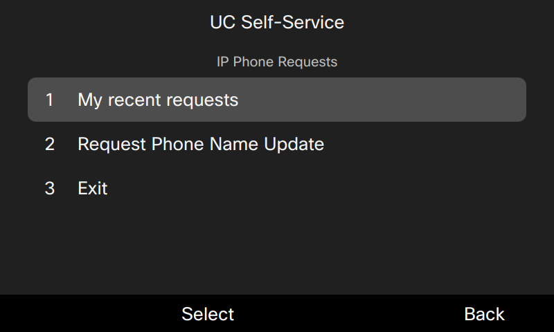
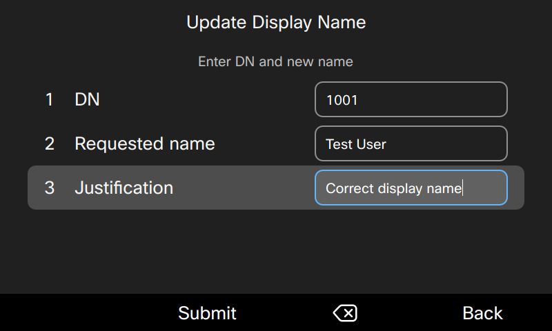
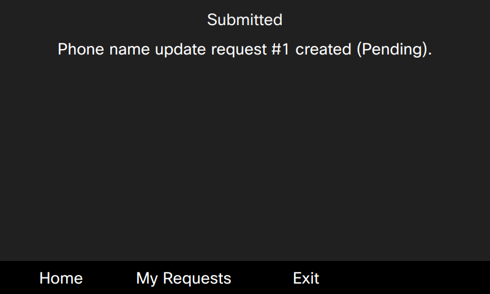
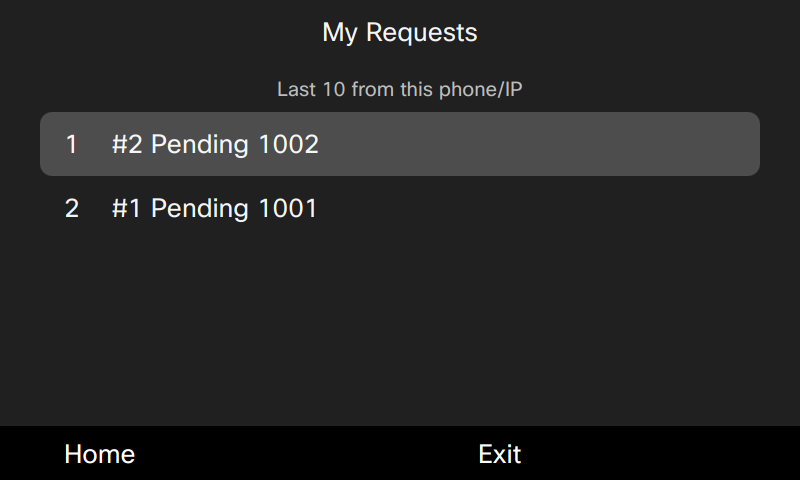
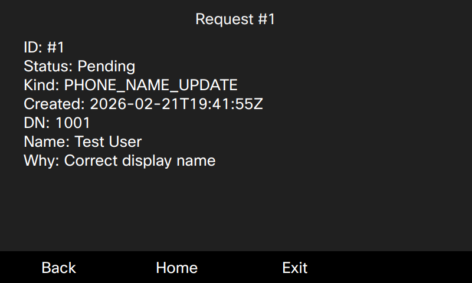
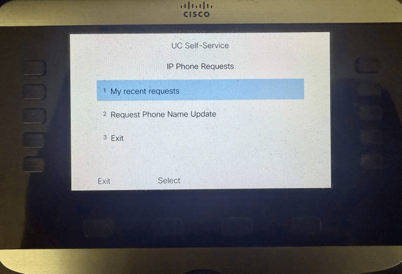
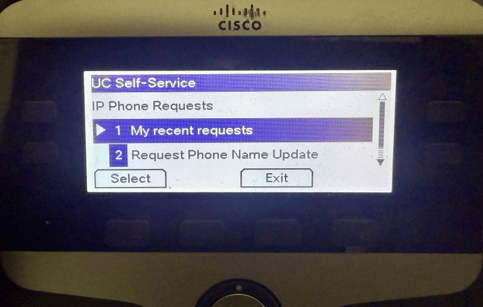
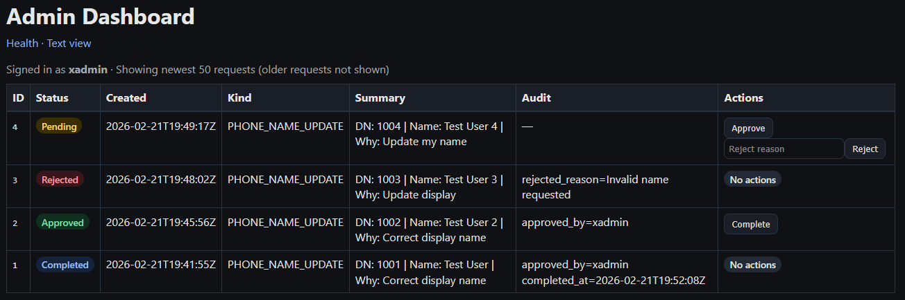

# UC Self-Service — Cisco IP Phone Framework

A lightweight Flask-based framework for building Cisco IP Phone XML self-service workflows delivered directly to desk phones.

This project demonstrates how structured Unified Communications (UC) request workflows can be initiated from Cisco IP phones and processed through a secure web-based administrative interface.

---

## Included Workflow (v0.2.0)

- Phone display name update request
- Per-phone request history
- Request detail view
- Administrator dashboard with approval workflow
- Structured audit trail and lifecycle management
- Reverse proxy + Gunicorn deployment model

---

## Architecture

``` code
Cisco IP Phones
→ Nginx (authentication + reverse proxy)
→ Gunicorn (WSGI)
→ Flask application
→ SQLite database
```

---

## Design Goals

- Minimal external dependencies
- Clear separation of proxy and application responsibilities
- Production-compatible service model (systemd + Gunicorn)
- Safe configuration via environment variables
- Extensible foundation for additional UC workflows
- Safe operation behind a reverse proxy

---

## Phone User Workflow

### Service Menu

Users launch UC Self-Service -> Requests from the phone's Services menu.



---

### Submit Display Name Update

The user provides:

- Directory Number (DN)
- Requested display name
- Justification



---

### Submission Confirmation

A Pending request is created with a unique ID.



---

### View Recent Requests

Users can review their most recent submissions from the same phone/IP.



---

### Request Details

Detailed information includes:

- Request ID
- Status
- DN and requested name
- Justification
- Timestamp



---

### Physical Phone Example

Cisco IP phone models such as the 8841 and 7841 support XML services used by this framework.





---

## Administrator Workflow

### Admin Dashboard

Administrators authenticate via Nginx Basic Auth and manage requests through a web interface.

Features:

- Recent request list (newest 50)
- Color-coded status indicators
- Approve / Reject / Complete actions
- Inline reject reason entry
- Audit information
- Automatic light/dark mode support



---

## Request Lifecycle

All requests follow a strict state machine:

``` code
Pending -> Approved -> Completed
Pending -> Rejected
```

State transitions are validated and applied atomically.

---

## Security Model

- Authentication handled by Nginx (Basic Auth)
- Authorization enforced by Flask ('require_admin' allowlist)
- Application bound to localhost behind reverse proxy
- SQLite datastore for v0.2.0
- Structured JSON request payloads with embedded metadata
- Parameterized SQL queries used for database operations

---

## Documentation

- [Architecture](docs/ARCHITECTURE.md)
- [Deployment](docs/DEPLOYMENT.md)
- [Production Readiness](docs/PRODUCTION_READINESS.md)
- [Risk Matrix](docs/RISK_MATRIX.md)

---

## Roadmap

Planned features and future work are tracked in the [Project Roadmap](docs/ROADMAP.md).

## Intended Use

This repository is provided as a lab/demo reference architecture for engineers building Cisco IP Phone based self-service tools or evaluating phone-driven workflows.

---

## Security Policy

Please review the [Security Policy](SECURITY.md) for vulnerability reporting guidelines.
